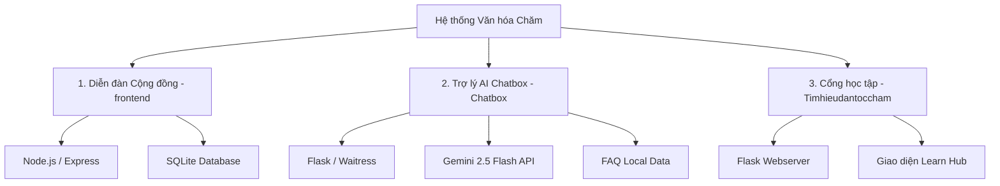

# 🏛️ Dự án Tìm Hiểu & Giao Lưu Văn Hóa Chăm (VHC)

Chào mừng bạn đến với **VHC (Văn hóa Chăm)** – hệ sinh thái ứng dụng tích hợp giúp tìm hiểu, học tập và kết nối cộng đồng về những nét đẹp văn hóa, lịch sử của dân tộc Chăm. Dự án bao gồm trang thông tin giáo dục, diễn đàn giao lưu cộng đồng và trợ lý AI thông minh giải đáp các thắc mắc về văn hóa.

---

## 🚀 Tổng quan kiến trúc hệ thống

Dự án được chia làm 3 phân hệ chính hoạt động độc lập nhưng bổ trợ cho nhau:



### 1. Diễn đàn Cộng đồng (`/frontend`)
* **Công nghệ**: HTML/CSS/JS (Frontend) + **Node.js / Express** + **SQLite** (Backend & Database).
* **Tính năng**:
  * Đăng ký & Đăng nhập (Mã hóa mật khẩu bằng `bcryptjs`).
  * Bảng tin mạng xã hội: Đăng bài viết kèm hình ảnh, phân loại theo chủ đề (Lễ hội, Ẩm thực, Trải nghiệm, Hỏi đáp, Daily...).
  * Tương tác: Thả tim (Like) bài viết, bình luận (Comment).
  * Thống kê Sidebar động: Bảng xếp hạng chủ đề nóng, vinh danh thành viên tích cực nhất.
  * Tự động khởi tạo & di chuyển dữ liệu (migration) tài khoản cũ từ file JSON sang SQLite.

### 2. Trợ lý AI Chatbox (`/Chatbox`)
* **Công nghệ**: **Flask** + **Waitress** (Production WSGI) + **Google Gemini 2.5 Flash API**.
* **Tính năng**:
  * Tự động quét và khớp câu hỏi nhanh dựa trên bộ dữ liệu local FAQ (`faq.json`) để tiết kiệm quota API.
  * Tích hợp gọi API của mô hình thế hệ mới Gemini 2.5 Flash để trả lời các câu hỏi văn hóa nâng cao.
  * Cơ chế kiểm soát quota thông minh: Hạn chế 20 câu hỏi/ngày trên tài khoản miễn phí và tự động reset bộ đếm khi hết ngày hoặc quá hạn ngạch.
  * Kết nối an toàn sử dụng biến môi trường `.env`.

### 3. Cổng thông tin & Học tập (`/Timhieudantoccham`)
* **Công nghệ**: **Flask** (Python) + Jinja2 HTML Templates.
* **Tính năng**:
  * Website tra cứu học tập chuyên sâu với giao diện trực quan.
  * Phân chia các trang kiến thức: Nguồn gốc lịch sử, Dân số, Ngôn ngữ & Chữ viết, Khu vực địa lý.

---

## 🛠️ Hướng dẫn cài đặt & Chạy ứng dụng

### 1. Chuẩn bị môi trường
Hãy đảm bảo máy tính của bạn đã cài đặt:
* **Node.js** (Phiên bản >= v18)
* **Python** (Phiên bản >= 3.10)

---

### 2. Chạy Phân hệ Diễn đàn Cộng đồng (`/frontend`)
1. Di chuyển vào thư mục `/frontend`:
   ```bash
   cd frontend
   ```
2. Cài đặt các gói phụ thuộc (Dependencies):
   ```bash
   npm install
   ```
3. Khởi động server Node.js:
   ```bash
   node script.js
   ```
4. Truy cập giao diện tại: **[http://localhost:3000](http://localhost:3000)**

---

### 3. Chạy Phân hệ Trợ lý AI Chatbox (`/Chatbox`)
1. Di chuyển vào thư mục `/Chatbox`:
   ```bash
   cd Chatbox
   ```
2. Cài đặt các thư viện Python cần thiết:
   ```bash
   pip install flask google-generativeai python-dotenv waitress
   ```
3. Thiết lập API Key:
   * Copy file cấu hình mẫu `.env.example` thành file `.env` cá nhân:
     ```bash
     copy .env.example .env
     ```
   * Mở file `.env` vừa tạo ra và điền khóa API Gemini mới của bạn vào:
     ```env
     GEMINI_API_KEY=AIzaSy...
     ```
4. Khởi động server Flask:
   ```bash
   python app.py
   ```
5. Hệ thống sẽ khởi chạy qua server Waitress tại cổng: **[http://localhost:81](http://localhost:81)**

---

### 4. Chạy Phân hệ Học tập (`/Timhieudantoccham`)
1. Di chuyển vào thư mục `/Timhieudantoccham`:
   ```bash
   cd Timhieudantoccham
   ```
2. Khởi động ứng dụng Flask giáo dục:
   ```bash
   python app.py
   ```
3. Truy cập trang học tập tại: **[http://localhost:10000](http://localhost:10000)**

---

## ⚠️ Quy tắc phát triển và An toàn bảo mật (Git Rules)

* **Bảo mật API Key**: **Tuyệt đối không** hardcode các API Key trực tiếp vào code nguồn hoặc commit file `.env` lên GitHub. Luôn sử dụng `os.environ` kết hợp với thư viện `dotenv` và kiểm tra kỹ file `.gitignore` trước khi commit.
* **Bảo toàn cơ sở dữ liệu và dependency**: Thư mục `node_modules` và file cơ sở dữ liệu `cham_culture.db` đã được đưa vào `.gitignore`. Không đẩy chúng lên repository chung để tránh xung đột dữ liệu và phình dung lượng repo.
